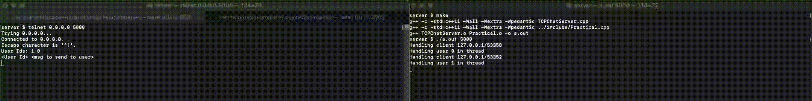

# Chat Room
The Chat Room is a simple chat application that allows multiple users to communicate with each other in real-time.

## Connecting to Server

## Sending Messages

## Usage

1. Start the chat server by running the following command:

   `./a.out <Port>`

   Replace `<Port>` with the desired port number.

2. Connect to the chat room using a telnet client:

   `telnet <Server IP> <Port>`

   Replace `<Server IP>` with the IP address of the chat server and `<Port>` with the corresponding port number.

3. To send a message to a specific user, use the following format:

   `<User Id> <Message to send>`

   Replace `<User Id>` with the identifier of the target user and `<Message to send>` with your message.

4. Enjoy real-time conversation and exchange messages with other participants.
