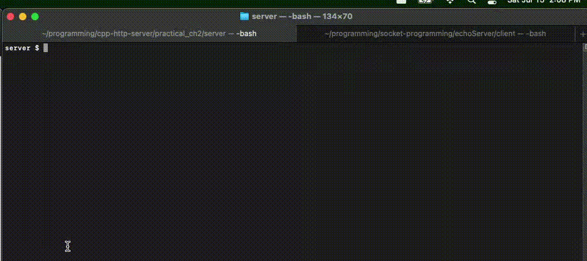

# Echo Server

The Echo Server project is a simple implementation of an echo server using C system calls for socket programming This project consists of two folders: client and server.

## Demo

## Server

The server folder contains the code and necessary files for running the server.

### Running the Server

To run the server, follow these steps:

1. Open a terminal.
2. Change the directory to the server folder:
 `cd server`
 
3. Compile the server code using the provided Makefile:
 `make`
 
4. Run the server executable:
 
 `./a.out`
 

## Client

The client folder contains the code and necessary files for running the client.

### Running the Client

To run the client, follow these steps:

1. Open a terminal.
2. Change the directory to the client folder:
 `cd client`
 
3. Compile the client code using the provided Makefile:
 `make`
 
4. Run the client executable with the required arguments:
 `./a.out <Server Address> <Echo Word> [<Server Port>]`

Note: The `<Server Address>` is the IP address or hostname of the server to connect to. The `<Echo Word>` is the word or phrase you want to send to the server for echoing. Optionally, you can provide `<Server Port>` to specify a non-default port (the default port is 79, which is common for echo servers).
